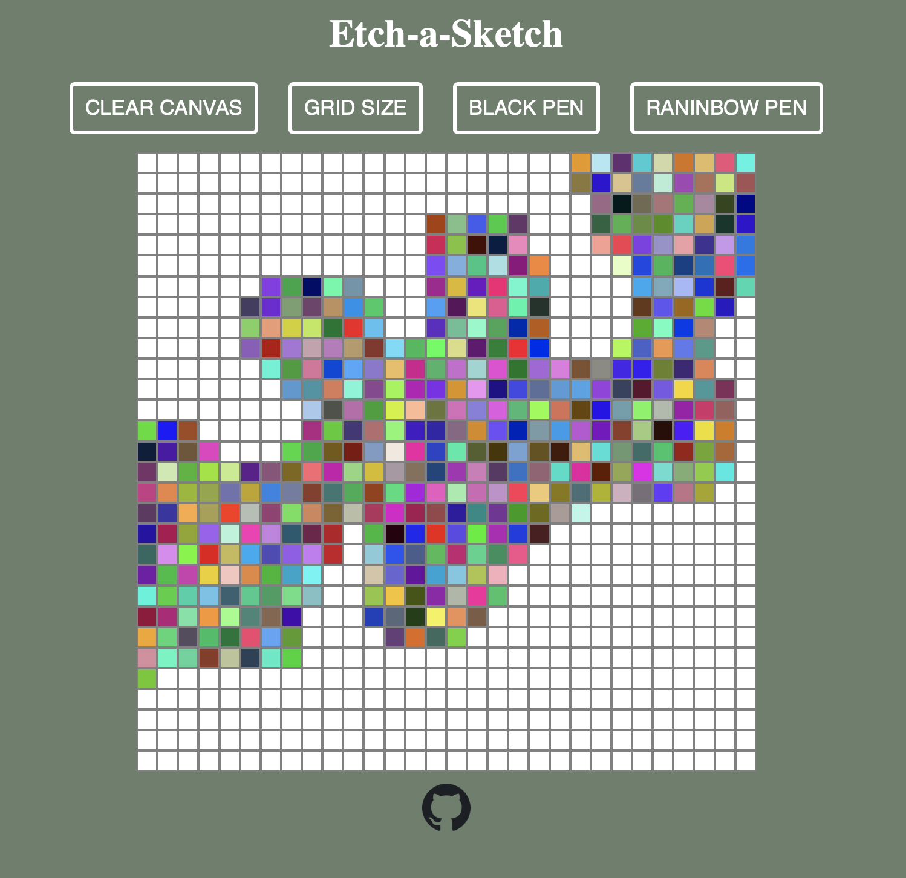

Heres an Etch-a-Sketch project from The Odin Project that I made after learning how to manipulate the DOM through query selection.

If you want to see a live demo, click here: [Live Demo](https://ericacosta505.github.io/etch-a-sketch/)

